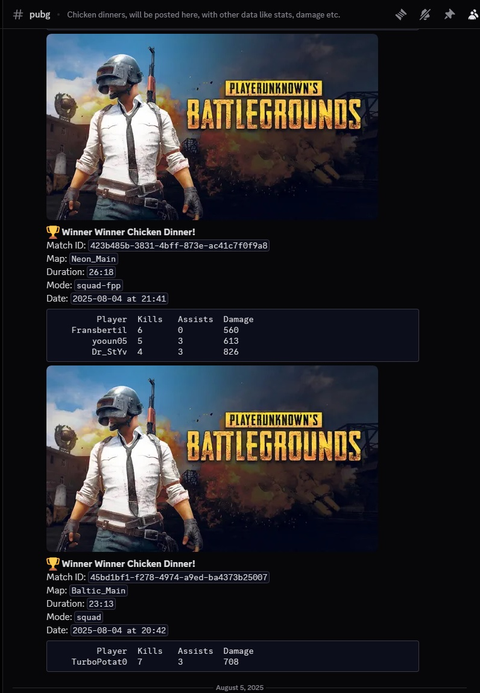

# PUBG API Project
This is a fun project I built to tracks certain players recent matches and statistics and post it to a specific discord channel. 

## Features

- Fetch player statistics
- Retrieve match details
- Easy-to-use API client
- Well-documented codebase

## Getting Started

### Prerequisites

- Python 3.7+
- PUBG API Key (register at [PUBG Developer Portal](https://developer.pubg.com/))

### Installation

Clone the repository:
Then swap the playernames, api key, discord webhook.
And you should be good to go.

### Run the program

cd into the project folder and run with python app.py
